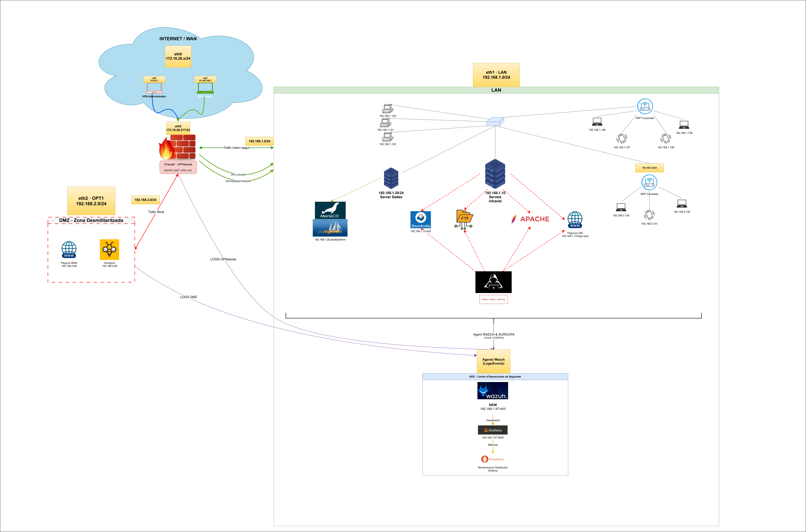

# Defensa Corporativa: NDR + SIEM + Resposta a Incidents

> **Avís legal:** Aquest projecte ha estat creat exclusivament amb fins educatius i d'aprenentatge en l'àmbit de la ciberseguretat. Tota la informació aquí publicada es proporciona "tal qual", sense cap garantia. L'autor no es fa responsable del mal ús que es pugui fer de les tècniques, eines o configuracions descrites. L'usuari final és l'únic responsable d'emprar aquests coneixements de manera ètica i legal, complint amb la normativa vigent (RGPD, LOPDGDD, ENS, etc.).

<p align="center">
  
</p>


## Descripció

Projecte final de l'**especialització en Ciberseguretat** (ASIX/ASIR). Consisteix en el disseny i desplegament d'una **arquitectura de defensa corporativa completa** basada en programari Open Source, amb un **SOC intern** amb SIEM, monitorització, detecció d'intrusions i resposta a incidents.


## Tecnologies utilitzades

| Tecnologia | Propòsit |
|---|---|
| **OPNsense** | Firewall perimetral, segmentació VLAN, IDS/IPS (Suricata), VPN, DHCP, DNS |
| **Wazuh** | SIEM (Manager, Indexer, Dashboard) |
| **Suricata** | IDS/IPS integrat amb Wazuh |
| **Prometheus + Grafana** | Monitorització de mètriques i dashboards |
| **WireGuard / OpenVPN** | VPN per a administradors i usuaris remots |
| **Cowrie** | Honeypot SSH en Docker |
| **Apache** | Servidor web |
| **Roundcube** | Webmail corporatiu |
| **Postfix + Dovecot** | Correu electrònic (SMTP/IMAP) |
| **vsftpd** | Servidor FTP |
| **MariaDB** | Base de dades |
| **Nmap / Hydra** | Eines de validació d'atacs |


## Contingut

```
📁 SOC-Infrastructure_Team-Fedora/
├── README.md
├── img/
└── docs/
    ├── memoria.md
    ├── instalacio_configuracio.md
    ├── administracio.md
    └── usuari.md
```

## Resum de la implantació

S'ha segmentat la xarxa en VLANs (LAN, DMZ, WiFi corporatiu, WiFi convidats, gestió) mitjançant OPNsense. S'han desplegat els serveis corporatius en màquines Fedora i Ubuntu Server dins de la LAN, i s'ha implementat un SOC amb Wazuh que centralitza tots els esdeveniments de seguretat.

Un honeypot Cowrie a la DMZ atrau atacants, i un entorn de proves amb atacs simulats (Nmap, Hydra, phishing) valida que el sistema detecta i alerta en menys de 30 segons.

Tot el projecte s'ha fet amb **programari Open Source** i amb un **pressupost ajustat**, demostrant que una pime pot disposar d'un SOC funcional sense grans inversions en llicències.
